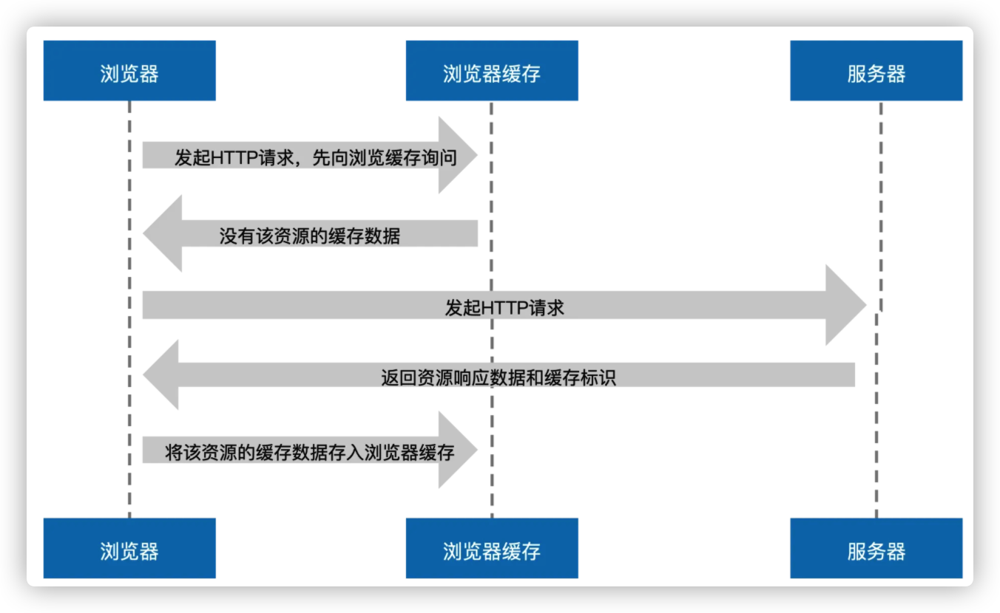
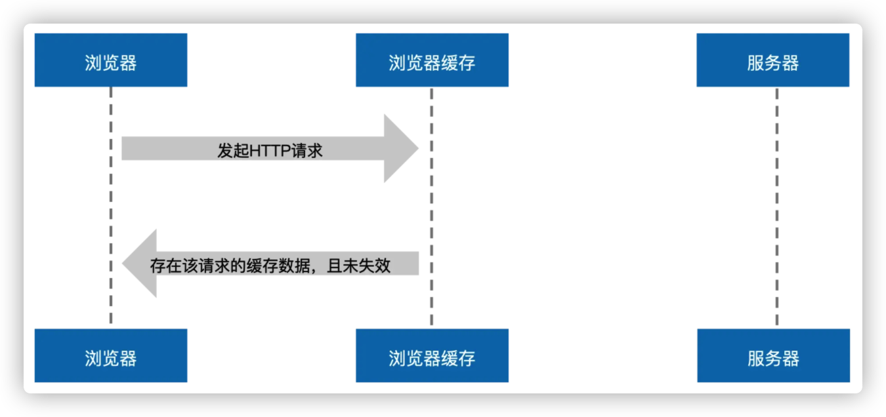

# 强缓存

对于强制缓存而言, 如果浏览器判断所请求的目标资源命中, 则直接从强制缓存中返回请求响应, 无需与服务器进行任何通信

## 强缓存生成过程

当浏览器发起 HTTP 请求时，会向浏览器缓存进行一次询问，若浏览器缓存没有该资源的缓存数据，那么浏览器便会向服务器发起请求，服务器接收请求后将资源返回给浏览器，浏览器会将资源的响应数据存储到浏览器缓存中，这便是强缓存的生成过程

## 强缓存生效过程

## Expires

Expires 是 HTTP1.0 时使用的强制缓存策略, 服务器设置 Expires 字段为一个日期, 客户端请求该资源时将这个日期与客户端当前日期进行比对, 如果当前时间小于这个日期, 则表示资源未过期, 使用缓存, 如果当前时间大于这个日期, 则表示资源已过期, 客户端就会重新请求该资源.
但是这一策略会收到客户端与服务器时间不一致的问题的影响.如果客户端时间晚于服务器的时间, 会导致资源还未过期就重新请求, 反之, 会导致客户端还在使用过期的旧资源.

## Cache-Control

为了解决 Expires 的局限性, HTTP1.1 协议新增了 cache-control 字段来对 Expires 进行补充和完善.

### 字段与值

- no-cache: 强制进行协商缓存, 每次请求都与服务器进行协商, 验证缓存是否有效
- no-store: 禁止使用任何缓存策略

- private: 私有缓存, 只能被客户端缓存, 不能被代理服务器缓存. (默认)
- public: 既可以被代理服务器缓存, 也可以被客户端缓存

- max-age: 过期时间, 相对时间, 相对本次请求之后的 XX 秒
- s-maxage: 仅在代理服务器中生效, 在代理服务器中 s-maxage 优先级高于 max-age，同时出现时 max-age 会被覆盖

## 总结

强缓存实现方式:

- Expires(兼容)
- cache-control(推荐, 会覆盖 Expires)
